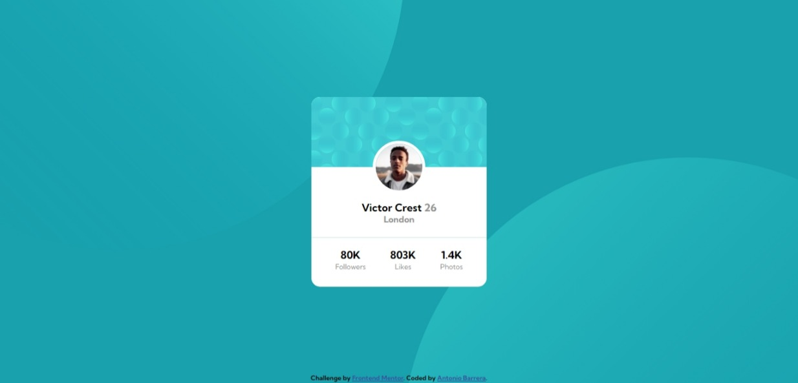

# Frontend Mentor - Profile card component solution

This is a solution to the [Profile card component challenge on Frontend Mentor](https://www.frontendmentor.io/challenges/profile-card-component-cfArpWshJ). Frontend Mentor challenges help you improve your coding skills by building realistic projects. 

## Table of contents

- [Overview](#overview)
  - [The challenge](#the-challenge)
  - [Screenshot](#screenshot)
  - [Links](#links)
- [My process](#my-process)
  - [Built with](#built-with)
  - [What I learned](#what-i-learned)
  - [Useful resources](#useful-resources)
- [Author](#author)

## Overview

### The challenge

- Build out the project to the designs provided

### Screenshot



### Links

- Solution URL: (https://github.com/antonio-barrera/profile-card-component-main)
- Live Site URL: (https://antonio-barrera.github.io/profile-card-component-main/)

## My process

### Built with

- Semantic HTML5 markup
- CSS custom properties
- Flexbox
- Desktop-first workflow

### What I learned

We can assign and custom multiple background resources like colors and images within one single element by separating them with a comma. They will be displayed as a stack, being the first one the closest to the viewer.

```css
body {
  background: 
    url('img1.svg'), 
    url('img2.svg'), 

    background-repeat: 
    no-repeat,
    no-repeat,

    background-position: 
    top -55rem left -28.5rem,
    bottom -59rem right -30rem,
}
```

### Useful resources

- [Assgin multiple backgrounds](https://css-tricks.com/css-basics-using-multiple-backgrounds/) - This blog helped me to learn how to use multiple background at once and how custom each of them.

## Author

- Frontend Mentor - [@antonio-barrera](https://www.frontendmentor.io/profile/antonio-barrera)
- Twitter - [@soyantoniob](https://www.twitter.com/soyantoniob)